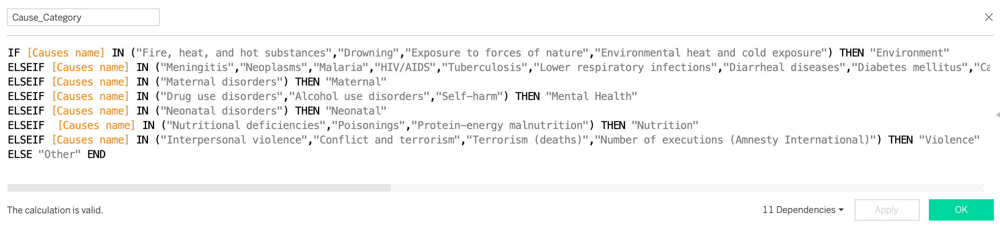

.center {
  display: block;
  margin-left: auto;
  margin-right: auto;
  width: 50%;
}

# Worldwide Mortality - Data Visualization in Tableau

## Project/Goals
Purpose of this project is to identify themes in mortality (cause and scale) across geographic regions using mortality data. Identified variances would be further reviewed to scope future health-improvement initiatives.

## Process
1. Data Acquisition
2. Feature Engineering
   3. Categories Causes of Death
   4. Categories countries based on Pop. Density
5. Qualitative Analysis
6. Hypothesis Test.
7. Dashboard

## Data Sources:
1. [Cause of Death - Our World In Data](https://www.kaggle.com/datasets/ivanchvez/causes-of-death-our-world-in-data?resource=download).
2. [World Population review](https://worldpopulationreview.com/countries)

## Feature Engineering

**Cause of Death Categorization:**  
> * Raw data file categories were too broad/numerous for either qualitative discovery or UI/UX  
> * Review categories and grouped according to 'theme'
> * Created hierarchy with 8 parent and 33 children  
> 
> * Engineering performed in Excel and data feed refreshed
> * Created Calculated Field in Tableau:  
> 

**Country Density - IQR and outliers:** [Excel]
  
 > Determine the percentiles and IQR using  
 >   * QUARTILE.INC(data_range,percentile_desired)  
 > * Categorize country in appropriate group:
 >   * IF(AND(R2>=Lower_outlier,R2<Quartile1),"Quartile 1",  
      IF(AND(R2>Quartile1,R2<Quartile3),"IQR",  
      IF(AND(R2>Quartile3,R2<Upper_outlier),"Quartile 3",  
      IF(OR(R2>Upper_outlier,R2<Lower_outlier),"Outlier",))))'
 > * Refresh Tableau data connection to utilize new column [Density_group]

## Results

> Published Dashboard:  
> [LHL-World Mortality](https://public.tableau.com/shared/HRX9FJGGF?:display_count=n&:origin=viz_share_link)

### Dashboard Home:  

* User selected the Category cause of mortality from the drop-down.
* Map graphic updates accordingly with the mortality rates normalized per 100,000 people in the population (2018).
* Relative breakdown of reasons within the selected category is shown in the donut chart.
* This chart serves as an initial starting point for opportunity identification. 

### Relative Contributions  

* Nested filter on the right hand pane allows User to mix/match categories and causes to further refine initial line of investigation. 
* Concurrently, stacked bar charts in lower pane update to provide comparative details between Top 10 "worst" countries and Western geographies.

### Analysis:  

* Preliminary hypothesis testing performed in the Analysis tab of Dashboard. 
* Hypothesis evaluate relationship between death rate (per 100k) and latitude, population density, and total population. 
* Note: evaluations were all ordinary simple linear regression (no multivariate)
* Countries were also segmented to enable analysis of outliers who would normally be dropped in such an investigation.
* User is able to select the Independent axis (latitude, population, density), the Density segment, and the Category. Chart will update accordingly. 

## Discussion:  

- looked at world map first. Selected various measures to see if any significant geographic differences. 
- maternal in sudan, mental health in north. 
- normalized the data against country population. 
- ** Clustering **
- 
- Investigations and hypothesis: 
### Mental Health
  - Hypothesis: related to Density or Latitude?
  - density
  - Latitude (link) https://www.ncbi.nlm.nih.gov/pmc/articles/PMC5302112/

**Feature Engineering**

### Maternal Health
  - Subsarha africa
  - 

### Illness
- Eastern Europe
- Cardiovascular
- Create group of Can/America vs Baltics
- compare trends over time with forecast (unadjuested per pop)

## Challenges 
(discuss challenges you faced in the project)

## Future Goals
(what would you do if you had more time?)