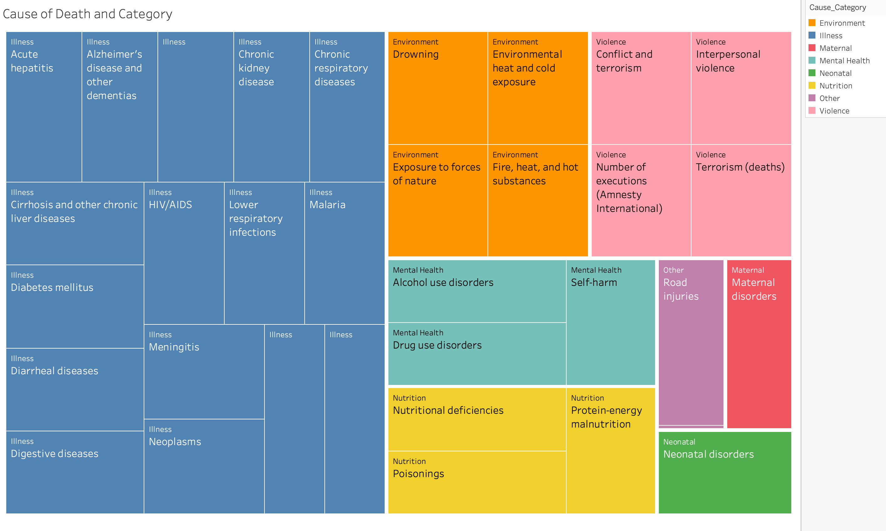

# Final-Project-Tableau

## Project/Goals
(fill in your description and goals here)

## Data Sources:
1. [Cause of Death - Our World In Data](https://www.kaggle.com/datasets/ivanchvez/causes-of-death-our-world-in-data?resource=download).
2. [World Population review](https://worldpopulationreview.com/countries)

## Process
* Data Acquisition
### Feature Engineering

**Cause of Death Categorization:**  
> * Raw data file categories were too broad/numerous for either qualitative discovery or UI/UX  
> * Review categories and grouped according to 'theme'
> * Created hierarchy with 8 parent and 33 children
> * 
> * Engineering performed in Excel and data feed refreshed
> * Created Calculated Field in Tableau:
> * 

**Country Density - IQR and outliers:** [Excel]
  
 > Determine the percentiles and IQR using  
 >   * QUARTILE.INC(data_range,percentile_desired)  
 > * Categorize country in appropriate group:
 >   * IF(AND(R2>=Lower_outlier,R2<Quartile1),"Quartile 1",  
      IF(AND(R2>Quartile1,R2<Quartile3),"IQR",  
      IF(AND(R2>Quartile3,R2<Upper_outlier),"Quartile 3",  
      IF(OR(R2>Upper_outlier,R2<Lower_outlier),"Outlier",))))'
 > * Refresh Tableau data connection to utilize new column [Density_group]

### (your step 2)

## Results

> Published Dashboard: [LHL-World Mortality](https://public.tableau.com/shared/HRX9FJGGF?:display_count=n&:origin=viz_share_link)

### Dashboard Home: 

### Relative Contributions

### Analysis: 

## NOtes
- looked at world map first. Selected various measures to see if any signgificatn geographic differences. 
- maternal in sudan, mental health in north. 
- normalized the data against country population. 
- ** Clustering **
- 
- Ivnestigations and hypothesis: 
### Mental Health
  - Hypothesis: related to Density or Latitude?
  - density
  - Latitude (link) https://www.ncbi.nlm.nih.gov/pmc/articles/PMC5302112/

**Feature Engineering**

### Maternal Health
  - Subsarha africa
  - 

### Illness
- Eastern Europe
- Cardiovascular
- Create group of Can/America vs Baltics
- compare trends over time with forecast (unadjuested per pop)

## Challenges 
(discuss challenges you faced in the project)

## Future Goals
(what would you do if you had more time?)